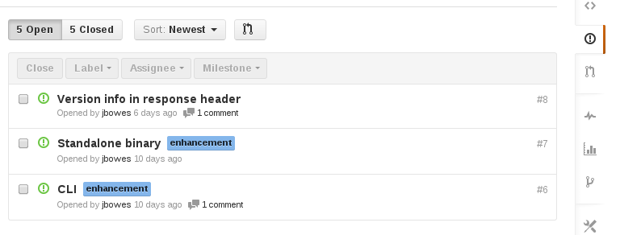
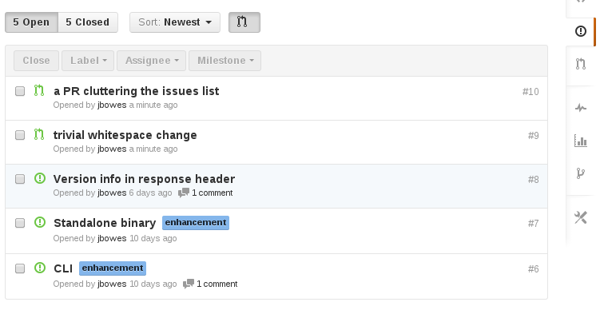

# No Pulls in Issue List Userscript

A userscript that adds a toggle button to remove pull requests from the issue
list. The button toggle state is saved in local storage, and applied to every
issue list.

## Pull Free

## Pulls Visible

